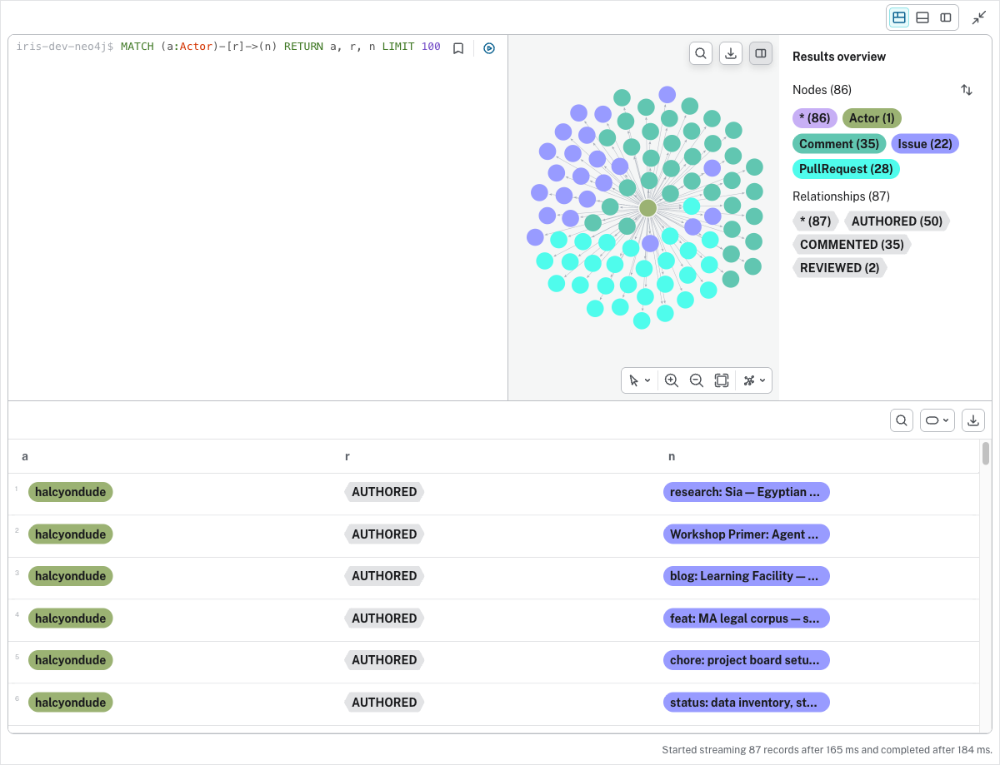

# Iris Has a Brain

Iris's brain is alive. Not a metaphor — a real, queryable, four-store database system that holds her project history as both structured records and a navigable graph.

Here's what it took, and how you'd do it yourself.

## What's running

Two databases, one brain:

```
$ dt-brain ls

BRAIN   TYPE   ENV   PG     NEO4J   PG SIZE   PG ROWS   NEO4J NODES   NEO4J EDGES
iris    iris   dev   ✓ up   ✓ up    100 kB    344       87            165
```

**Postgres** holds the structured records — 344 rows across 36 tables in three schemas:
- `brain.*` — shared infrastructure (query ledger, watermark, module registry)
- `gharchive.*` — 18 typed event tables for GH Archive data (empty until we run that ingestion)
- `github_project.*` — issues, pull requests, comments, timelines, and relationship tables

**Neo4j** holds the knowledge graph — 87 nodes and 165 edges representing who authored what, which PRs closed which issues, and who commented where.

## The graph

This is what Iris sees when she looks at `dreamteam-hq/learning`:



One actor (halcyondude) at the center, radiating out to 22 issues (purple), 28 pull requests (green), and 35 comments (teal). The edges tell the story: 50 AUTHORED relationships, 35 COMMENTED, 25 ON (comment → parent), 3 CLOSES (PR → Issue), 2 REVIEWED.

Some queries that work right now:

**Which PRs closed issues?**
```cypher
MATCH (pr:PullRequest)-[:CLOSES]->(i:Issue)
RETURN pr.number AS pr, pr.title, i.number AS issue, i.title
```

Returns three rows — PR #47 closed the brain proving ground epic (#43), PR #44 closed the agentskills restructure handoff (#42), PR #26 closed the content staging spike (#22).

**Full traversal — who authored PRs that closed issues?**
```cypher
MATCH (a:Actor)-[:AUTHORED]->(pr:PullRequest)-[:CLOSES]->(i:Issue)
RETURN a.login, pr.number, pr.title, i.number, i.title
```

**Most commented issues:**
```cypher
MATCH (c:Comment)-[:ON]->(i:Issue)
RETURN i.number, i.title, count(c) AS comments
ORDER BY comments DESC LIMIT 5
```

The Workshop Primer (#49) and the MVVM for Godot research (#24) top the list with 3 comments each.

## How to reproduce this

### Prerequisites

```bash
brew install postgresql@18
brew install cypher-shell
brew install ariga/tap/atlas
brew install michael-simons/homebrew-neo4j-migrations/neo4j-migrations
```

Neo4j Desktop installed with a local DBMS running (password: `dreamteam`). APOC and GDS plugins installed via the Desktop UI.

### Clone the repos

```bash
cd ~/gh/dreamteam-hq
git clone git@github.com:dreamteam-hq/brain.git
git clone git@github.com:dreamteam-hq/brain-domains.git
git clone git@github.com:dreamteam-hq/iris.git
```

### Provision the brain

```bash
cd brain
uv run dt-brain create iris --env dev \
  --brain-yaml ~/gh/dreamteam-hq/iris/brain.yaml
```

This resolves 4 domains (brain, gharchive, github-project, git-history), creates the Postgres database with all schemas, creates the Neo4j database, and applies constraints.

### Ingest data

```bash
cd ~/gh/dreamteam-hq/iris/scripts

# Step 1: GitHub GraphQL → DuckDB
GITHUB_TOKEN="$GITHUB_PERSONAL_ACCESS_TOKEN" \
  uv run --with duckdb python3 ingest_github_history.py \
  --repo dreamteam-hq/learning \
  --db /tmp/iris-ingest/github.duckdb

# Step 2: DuckDB → Postgres
uv run --with duckdb --with psycopg2-binary python3 -c "
import duckdb
conn = duckdb.connect('/tmp/iris-ingest/github.duckdb')
conn.execute('INSTALL postgres_scanner; LOAD postgres_scanner;')
conn.execute(\"ATTACH 'dbname=iris-dev-postgres' AS pg (TYPE postgres);\")
for t in ['issues','pull_requests','comments','pr_closes','pr_reviews','timeline_events']:
    count = conn.execute(f'SELECT count(*) FROM {t}').fetchone()[0]
    if count > 0:
        conn.execute(f'INSERT INTO pg.github_project.{t} SELECT * FROM {t}')
        print(f'  {t}: {count} rows')
conn.close()
"

# Step 3: Postgres → Neo4j graph
uv run --with neo4j --with psycopg2-binary python3 promote_to_neo4j.py
```

### Verify

```bash
dt-brain ls                    # shows iris-dev with row/node/edge counts
dt-brain health                # both stores healthy
psql -d iris-dev-postgres -c "SELECT schemaname, count(*) FROM pg_tables
  WHERE schemaname IN ('brain','gharchive','github_project')
  GROUP BY schemaname;"        # 3 schemas, 36 tables
```

Open Neo4j Browser at `http://localhost:7474`, connect to `iris-dev-neo4j`, and run:
```cypher
CALL apoc.meta.graph()
```

You'll see the schema — Actor, Issue, PullRequest, Comment, Repository — and all the edges between them.

## What's next

This is one small repo. The pipeline is the same for `halcyondude/dreamteams` (1000+ issues), all `dreamteam-hq/*` repos, and eventually GH Archive event streams (18 typed event tables waiting for data).

The brain platform supports multiple agents. Sia (our SRE agent, they/them) gets an ops brain next. Docent gets a plugin catalog brain. Den Mother gets a legal case brain. Each agent declares which knowledge domains it needs, and `dt-brain create` composes them.

The four-store architecture is validated. The ingestion pipeline works. The graph is queryable. Iris has a brain, and she can see her project history.

Now we feed her more.
