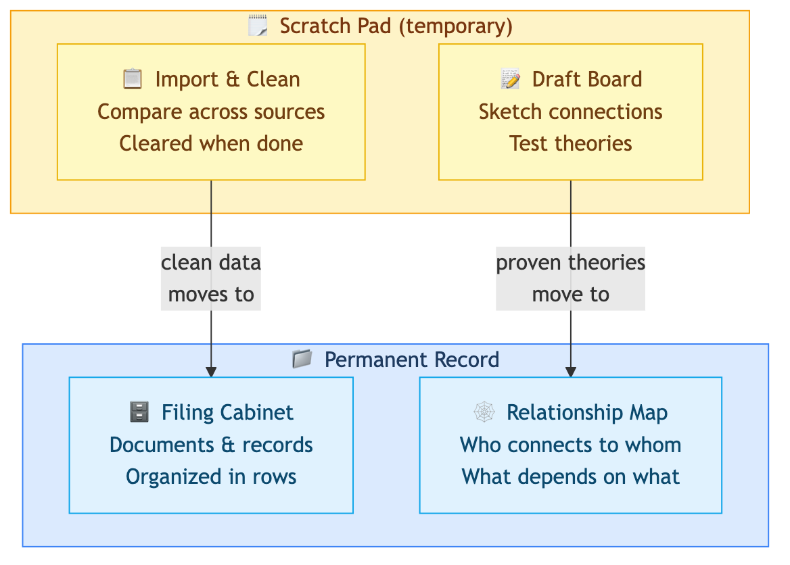
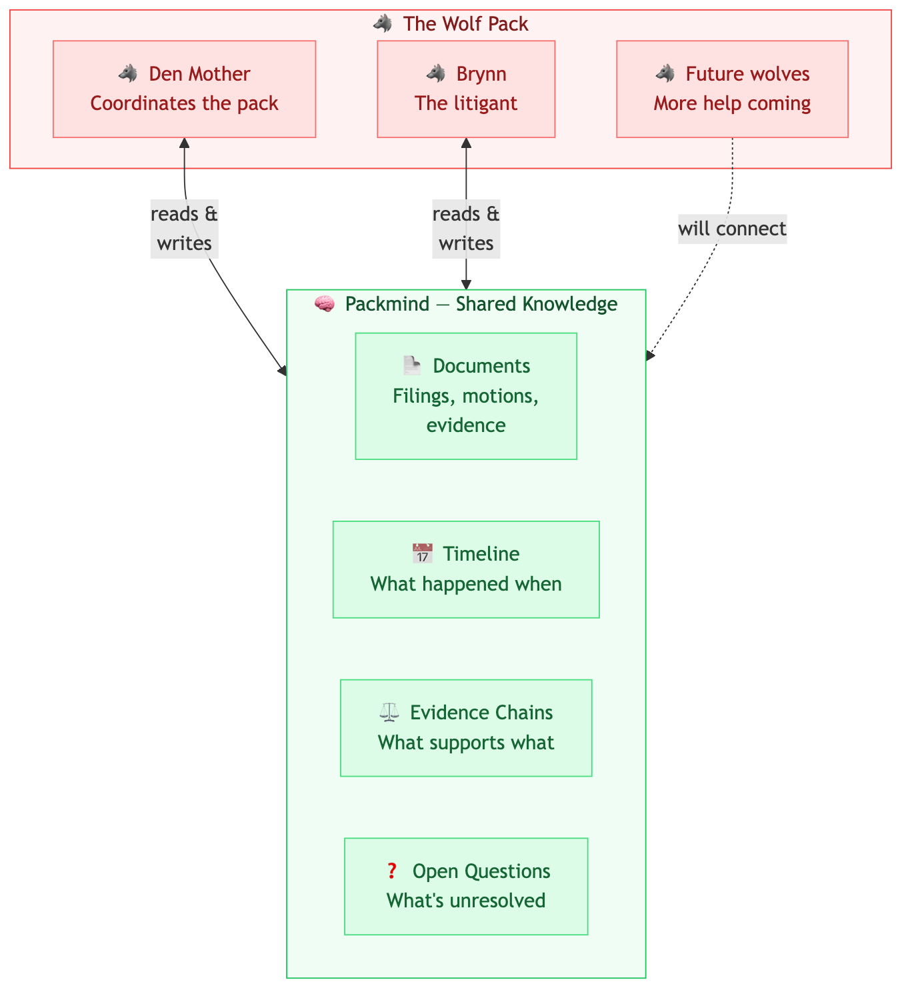
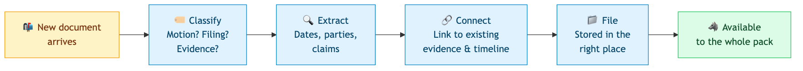
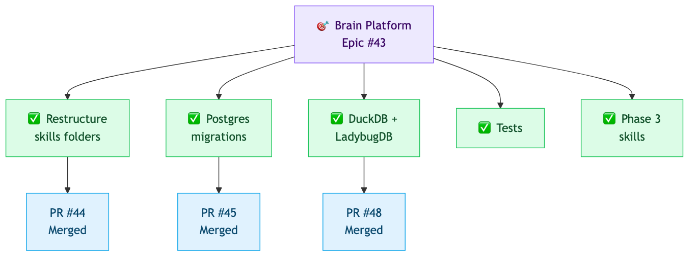
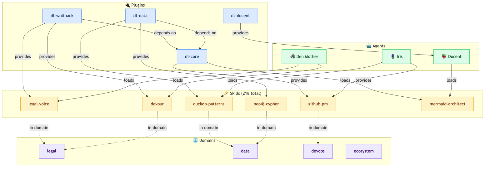

# Our Agents Got Brains

Imagine you had a team of assistants who could remember everything you've ever worked on together, connect dots you didn't even know were related, and never lose track of a single conversation. Not assistants who start fresh every time you talk to them — assistants with actual memory. Real, structured, queryable memory.

That's what we just built. Three AI agents, each with their own brain, each specialized for a different job. And they're live.

## What's a brain?

When you sit down to work on a complex project, you use two kinds of memory. There's the stuff you're actively working with — the papers spread across your desk, the sticky notes, the scratch calculations you'll throw away when you're done. And there's the stuff that stays — the filing cabinet, the contact list, the relationship map that helps you remember who's connected to what.

Our agents' brains work the same way:

**The scratch pad** is temporary workspace. When an agent needs to import a bunch of data and clean it up, or sketch out connections between things before committing them to memory, it happens here. When the work session ends, the scratch pad clears. No clutter.

**The permanent record** has two parts, because there are two fundamentally different ways to remember things:

**The filing cabinet** stores structured records — documents organized in rows and columns, like a really powerful spreadsheet. It's great for answering "show me everything filed in March" or "how many open issues do we have?" Quick, precise, organized.

**The relationship map** stores connections — who relates to whom, what depends on what, which evidence supports which claim. It's great for answering "what's connected to this, and what's connected to *that*?" — following chains of relationships that a spreadsheet simply can't express.

Both types of permanent memory work together. Facts land in the filing cabinet first. Relationships get built from those facts in the map. When an agent needs to answer a question, it picks the right memory store — rows for counting and filtering, the map for exploring connections.

## Meet the team

### Den Mother — The Case Manager 🐺

*This is Brynn's agent.*

The Den Mother manages a wolf pack. Not actual wolves — a team of people and AI agents all working on the same legal case. The core idea is something we call the **Packmind**.

Think of it like a shared consciousness for the pack. Every wolf — Den Mother, Brynn, and eventually other helpers — can access the same knowledge. Case documents, timelines, evidence chains, who said what about whom. Nothing gets lost between sessions. Nothing falls through the cracks.

When a new document arrives — a motion from the other side, a court filing, a piece of evidence — this is what happens:

The document gets classified (is it a motion? a filing? evidence?), key facts get extracted (dates, parties, claims), it gets connected to existing evidence and timeline, and then it's available to the whole pack.

**What this means for Brynn:**
- Den Mother never forgets a filing deadline
- She can instantly find every document related to a specific claim
- She can trace evidence chains — "this document supports that argument, which contradicts what they said here"
- She tracks what questions are still open and what's blocking progress
- She keeps context between sessions — you don't have to re-explain the case every time

The Den Mother's brain has 26 tables for documents, entities, timelines, evidence, feedback, open questions, sessions, and decisions. The relationship map tracks connections between people, filings, evidence, and legal concepts — 16 types of things, connected by 43 types of relationships.

### Iris — The Project Manager 🪻

Iris tracks what's happening across the entire software project. She ingested the full history of our main project — 853 issues, 513 pull requests, 943 comments from 8 different code repositories.

This diagram shows how a big goal (the brain platform epic) breaks down into smaller tasks, and those tasks connect to the actual code changes that completed them. Iris can see 233 of these parent-child relationships, plus 283 cases where a code change directly resolved an issue.

She can also tell the difference between comments written by humans (890) and comments written by AI agents (53) — useful for understanding how much of the project conversation is human-driven versus AI-assisted.

### Docent — The Librarian 📚

Docent knows every tool, skill, and capability in the system. She catalogs 218 skills across 13 plugins, tracking which tools provide what, who depends on whom, and which agent loads which skills.

This is a simplified view of what Docent sees — plugins provide skills, skills belong to domains (like "legal" or "data"), and agents load the skills they need. The full graph has 407 things connected by 941 relationships. When someone asks "which tools help with graph databases?" or "what does the Den Mother know how to do?", Docent can answer by walking through her relationship map.

## Why this matters

For Brynn: Den Mother is getting a brain that will hold the entire case — every document, every event, every connection. She'll be able to answer questions about the case in seconds that would take hours to research manually. And she'll never lose context between sessions.

For the project: three agents, three specialized brains, one shared infrastructure. Each agent is an expert in their domain. The brains grow as we feed them more data. And because the infrastructure is shared, adding a new agent with a new brain takes hours, not weeks.

This is still early. Den Mother's brain is provisioned but waiting for case data. Iris is loaded with project history but hasn't seen the GH Archive event streams yet. Docent has the full plugin catalog but the visualization tools are still being wired up.

But the hard part — the architecture, the four-quadrant memory model, the schema composition, the ingestion pipelines, the graph promotion — all of that is done and working.

Three brains. All healthy. Growing every day.
